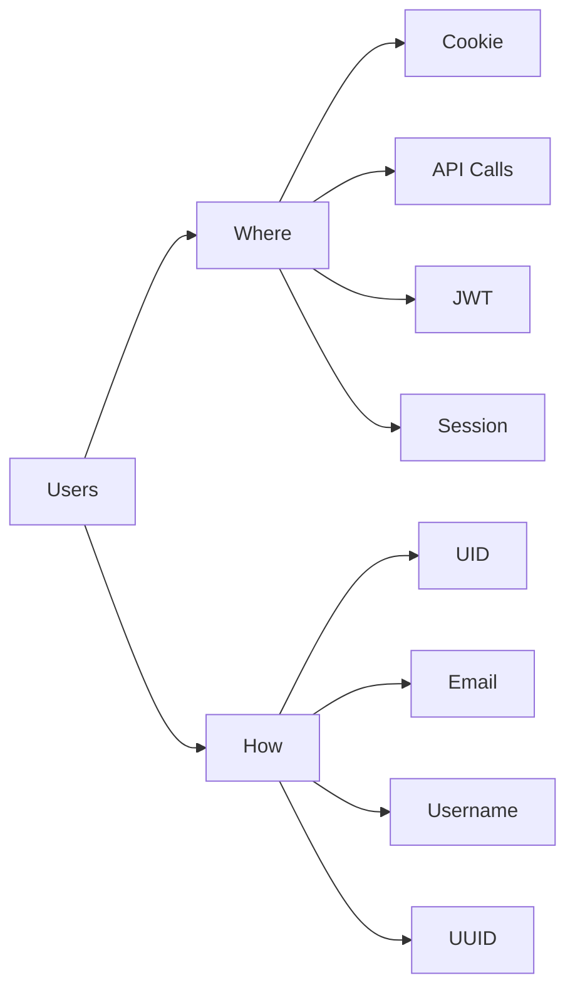
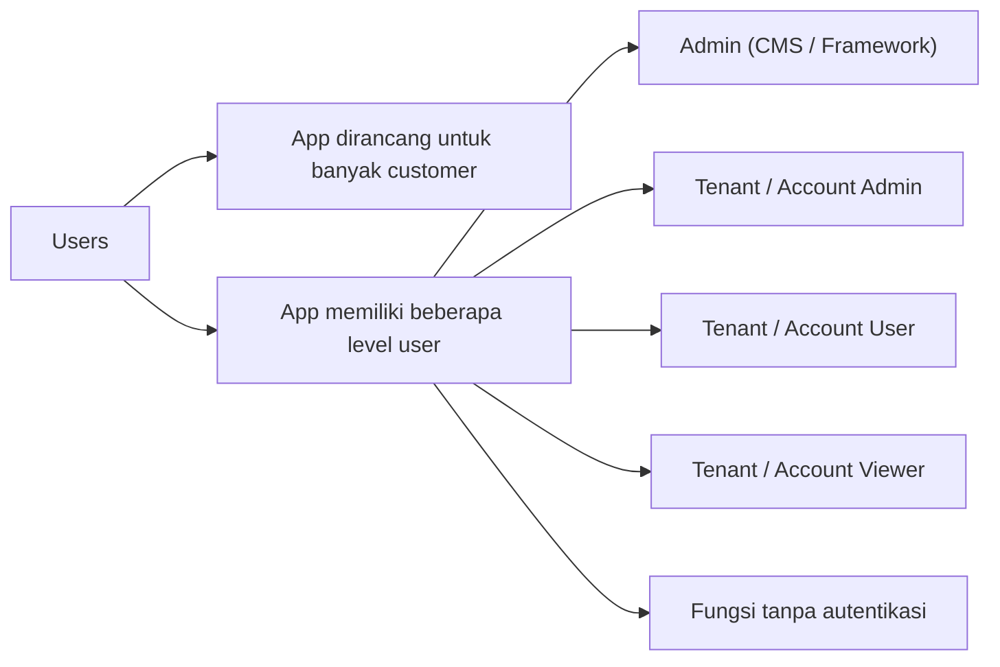

# ASNs & More

[https://bgp.he.net/](https://bgp.he.net/)

* Autonomous System Number (ASN) diberikan ke jaringan besar. ASN membantu kita melacak infrastruktur IT suatu entitas secara kasar. Cara paling reliable untuk mendapatkannya adalah manual lewat search gratis dari Hurricane Electric.
* Karena adanya cloud infrastructure, ASN tidak selalu memberikan gambaran lengkap sebuah jaringan. Asset liar bisa saja ada di environment cloud seperti AWS dan Azure. Di sini kita bisa melihat beberapa range IP.

[https://dnschecker.org/](https://dnschecker.org/)
[https://asrank.caida.org/](https://asrank.caida.org/)

* Kita juga bisa menggali lebih dalam di caida.org untuk menemukan ASN yang berhubungan.

[https://github.com/expl0itabl3/check_mdi](https://github.com/expl0itabl3/check_mdi)

* Autodiscover service di Microsoft Exchange digunakan untuk mengkonfigurasi endpoint client secara otomatis dengan setting yang diperlukan untuk berkomunikasi dengan Exchange server.
* Pada web API bisa membocorkan banyak informasi.

```
./check_mdi.py -d <domain>
```

---

# ASN ke Port Scan

Catatan port scanning:

* Naabu adalah salah satu port scanner paling usable.
* Rustscan secara empiris paling cepat.
* Nmap paling fleksibel dan extensible.
* ASN bisa dikonversi menggunakan ASNmap.

```
echo AS394161 | asnmap -silent | naabu -silent
echo AS394161 | asnmap -silent | naabu -silent -nmap-cli 'nmap -sV'
```

---

# Passive Port Scan (SMAP)

Smap adalah port scanner yang dibuat menggunakan API gratis Shodan.io.

Tool ini menggunakan argumen command line yang sama seperti Nmap dan menghasilkan output yang sama, jadi bisa jadi pengganti langsung Nmap.

Cocok untuk red team yang ingin minim noise.

```
smap target.com
```
# Cloud Recon

## Apa yang Kita Cari?

Kita akan menggunakan enumerasi sertifikat SSL untuk menemukan subdomain dari target kita.

Ini juga bisa menghasilkan:

* Domain apex
* Nama domain internal

---

## Kenapa Sertifikat?

Field pada sertifikat memberikan semua informasi yang kita butuhkan:

* Common Name (Nama umum)
* Organization (Organisasi)
* Subject Alternative Name (Nama subjek alternatif)

---

## Scanning the Cloud for Certs

Kita bisa terkoneksi ke sebuah IP dan meminta sertifikat SSL-nya, lalu mem-parse:

* CN
* OU
* SAN domain

dari sertifikat tersebut.

Jika sebuah IP memiliki sertifikat SSL yang menyebutkan target kita di salah satu field tersebut, maka kemungkinan service mereka berada di sana.

Kita juga bisa melakukan scanning ke seluruh range IP milik provider cloud (seperti AWS) di level IP, mengunduh semua field sertifikat, lalu melakukan grep untuk mencari IP mana saja yang sertifikatnya menyebutkan target kita.

Contoh: `twitch.tv`

Dengan cara ini kita bisa mengetahui sebagian besar infrastruktur cloud milik Twitch.

```id="qhhx4k"
http://ec2-reachability.amazonaws.com/
```

---

# TOOLS

## Cloud Recon (IPs)

Ambil IP ranges di sini:

```id="nhl3jx"
https://github.com/lord-alfred/ipranges/blob/main/all/ipv4_merged.txt
```

Tool:

```id="g47w6v"
https://github.com/g0ldencybersec/CloudRecon
```

---

## Caduceus

```id="vok6gk"
https://github.com/g0ldencybersec/Caduceus
```

Caduceus adalah simbol Hermes atau Merkurius dalam mitologi Yunani dan Romawi.

Simbol ini sering dikaitkan dengan:

* Pedagang
* Pembawa pesan
* Pencuri
* Penjahat

Caduceus merupakan tool untuk melakukan scanning IP atau CIDR guna mencari sertifikat SSL.

Tool ini memungkinkan kita menemukan:

* Domain tersembunyi
* Organisasi baru
* Infrastruktur tambahan
* dan lainnya

### Dukungan Input

* IP & CIDR dipisahkan koma
* File berisi IP/CIDR per baris
* File format `ip:port`
* stdin

---

## Cloud Recon Backup

```id="10zkf7"
https://kaeferjaeger.gay/
```

Kelompok hacker Kaeferjaeger melakukan scanning ke seluruh major cloud provider setiap minggu.

Mereka mengambil seluruh data sertifikat SSL dari IP-IP cloud tersebut dan menyediakannya untuk diunduh.

Kita bisa melakukan pencarian pada data sertifikat tersebut untuk mencari target kita.

---

## Gungnir

```id="a8u5ta"
https://github.com/g0ldencybersec/gungnir
```

Digunakan untuk monitoring sertifikat secara terus-menerus.

---

# Quick ASN Recon (Dengan Caduceous)

Ingat saat kita mengambil range IP dari ASN?

Daripada melakukan port scanning ke seluruh range tersebut, kita bisa langsung melakukan scraping menggunakan Caduceous.

Gunakan:

* Instant Data Scraper Chrome Extension

---

# Subdomain Scraping

Subdomain scraping adalah salah satu kontributor terbesar dalam enumerasi subdomain.

---

## Web Scraping untuk Subdomain

Informasi domain dan URL digunakan di internet untuk banyak keperluan.

Ada banyak project data yang mengekspos database URL atau domain yang mereka simpan.

Dalam project dengan scope besar, kita bisa melakukan query ke website dan API tersebut untuk menemukan subdomain yang mungkin mereka ketahui terkait target kita.

Untungnya, kita tidak perlu melakukannya secara manual karena sudah ada banyak tools untuk ini.

Ini hanyalah sebagian kecil sumber yang tersedia — masih banyak lagi yang lain.

---

## Google Dork

```id="hjlwmh"
site:twitch.tv -www.twitch.tv -watch.twitch.tv -dev.twitch.tv
```

---

## Tools

* Subfinder
* Amass
* bbot

# App Analysis

## Konsep Analisis (Pertanyaan Besar)

Saat menganalisis sebuah aplikasi web, selain memahami tech stack yang digunakan, penting juga untuk menanyakan pertanyaan-pertanyaan spesifik kepada diri sendiri tentang bagaimana aplikasi tersebut bekerja.

Berikut beberapa pertanyaan yang biasa saya gunakan untuk membantu memahami aplikasi dengan lebih baik dan menentukan bagaimana pendekatan hacking yang akan dilakukan.

Nanti kita akan membahas ini lebih dalam.

---

* Bagaimana aplikasi mengirim dan memproses data?
* Bagaimana dan di mana aplikasi menangani data user?
* Apakah aplikasi memiliki multi-tenancy atau level user?
* Apakah aplikasi memiliki threat model yang unik?
* Apakah sudah ada riset keamanan atau vulnerability sebelumnya?
* Bagaimana aplikasi atau framework menangani class vulnerability tertentu?


## Big Questions (Passing Data)

Pertanyaan pertama yang saya tanyakan saat melihat sebuah aplikasi adalah:

> **Bagaimana aplikasi mengirim dan memproses data?**

Apakah aplikasi menggunakan format:

```id="k9pq2v"
https://app.com/resource?parameter=value&param2=value
```

atau menggunakan format RESTful:

```id="w2tm8x"
https://app.com/route/resource/sub-resource/...
```

Memahami hal ini akan menjadi fondasi utama dalam menguji berbagai kategori bug.

Bug-nya mungkin ada, tapi jika kita tidak memahami di mana payload harus diinjeksi, maka pengujian akan gagal.

---

## Big Questions (Users)

Selanjutnya, saya bertanya:

> **Bagaimana dan di mana aplikasi menangani data user?**

Memahami bagaimana user (diri kita maupun user lain) direferensikan dan di mana data tersebut digunakan dalam aplikasi sangat penting untuk menemukan beberapa class vulnerability, terutama:

* Access bugs
* Authorization bugs
* Logic bugs
* Information Disclosure bugs

---

### Mindmap Users




## Big Questions (User Level)

> **Apakah aplikasi memiliki multi-tenancy atau level user yang berbeda?**

Hal ini juga akan menentukan bagaimana kita menguji bug authorization dan access control.




## Big Questions (Threat Model)

> **Apakah aplikasi memiliki threat model yang unik?**

Jika aplikasi menyimpan data yang lebih dari sekadar data PII standar, mudah untuk lupa menjadikan data tersebut sebagai target dalam pengujian.

Contoh:

* API keys
* Data aplikasi yang bisa digunakan untuk doxing


## Big Questions (Security Research)

> **Apakah sudah ada riset keamanan atau vulnerability sebelumnya?**

Mencari vulnerability lama atau security research sebelumnya bisa membantu memahami:

* Pola bug yang sering muncul
* Komponen yang lemah
* Attack surface yang pernah terekspos
* Class vulnerability yang kemungkinan masih ada

Contoh sumber:

* CVE
* HackerOne reports
* Blog research
* GitHub issues
* Exploit-DB


## Big Questions (Handling Vulns)

> **Bagaimana aplikasi atau framework menangani vulnerability tertentu?**

Beberapa framework atau aplikasi memiliki cara penanganan bug yang berbeda-beda.

Memahami hal ini membantu menentukan:

* Di mana payload diuji
* Filter atau sanitasi yang digunakan
* Mekanisme proteksi bawaan
* Perilaku error handling
* Kemungkinan bypass

Contoh:

* XSS filtering
* CSRF protection
* SSRF restriction
* Input validation
* Ouotput Encoding
* Rate limiting
* File upload validation


##  Big Questions (Data Storage)

> **Bagaimana aplikasi menyimpan data?**

Pertanyaan terakhir yang biasanya saya tanyakan saat melihat sebuah aplikasi adalah bagaimana aplikasi tersebut menyimpan data.

Hal yang perlu diperhatikan:

* Ke mana image dan file upload disimpan?
* Jenis database apa yang kemungkinan digunakan?
* Apakah data disimpan di cloud storage?
* Apakah ada object storage seperti S3?
* Bagaimana aplikasi menangani cache dan session storage?


# Heat Mapping

Heat mapping adalah proses memetakan area atau fitur aplikasi yang paling menarik, paling aktif, atau paling berpotensi memiliki vulnerability.

Tujuannya bukan langsung mencari bug, tetapi memahami:

* Endpoint yang paling sering digunakan
* Fitur dengan kompleksitas tinggi
* Area dengan banyak interaksi user
* Jalur data sensitif
* Fungsi admin atau privileged
* Integrasi pihak ketiga
* Tempat terjadinya perubahan state/data

Biasanya heat mapping dilakukan dengan:

* Menjelajahi seluruh fitur aplikasi
* Mencatat request dan response
* Mengelompokkan endpoint berdasarkan fungsi
* Menandai fitur yang “menarik”
* Menghubungkan flow antar fitur

Semakin jelas heat map aplikasi, semakin mudah menentukan area yang layak difokuskan untuk testing.


## Area yang Lebih Sulit Diamankan

* Headers
* Penanganan URL
* Penanganan file
* Parsing data
* File upload
* Integrasi pihak ketiga
* Webhook
* Permission handling
* Session management

---

## Fitur Baru

* Fitur baru
* Redesign → regression
* Endpoint baru
* Migrasi backend
* Perubahan framework
* Refactor besar
* Beta features
* Experimental features

---

## Gated Features

* Fitur berbayar
* Fungsi admin
* Internal dashboard
* Super admin panel
* Hidden routes
* Staff functionality
* API internal
* Feature flags
* Tenant management
* Billing functionality
