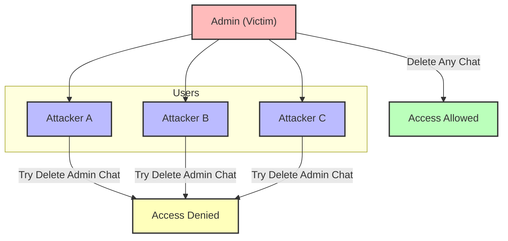
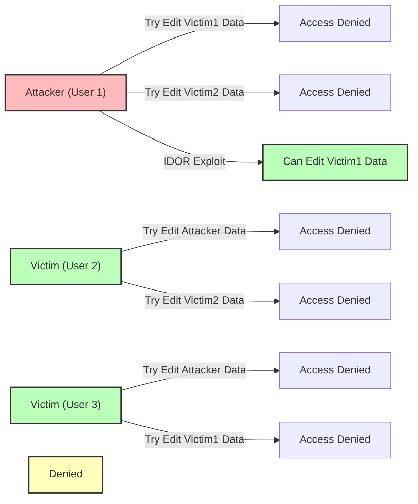

# **Pembahasan BAC dan IDOR**

**BAC** → *Broken Access Control*
**IDOR** → *Insecure Direct Object Reference*

---

## **Persamaan BAC dan IDOR**

Persamaan kedua bug ini adalah tentang masalah **Akses kontrol**, yang dimana suatu website/aplikasi itu tidak memvalidasi hak akses degan benar

* **BAC = Vertical access control**
* **IDOR = Horizontal access control**

---

## **Penjelasan Vertical & Horizontal**

**Vertical** ini biasanay mainnay itu di *role* nya, misalkn kasusunay di suatu website itu ada *admin, member, operator, dan lainnya*

**Horizontal** itu misalkna ada victim dengan role tinggi, dan attacker dengan role rendah dia tidak memiliki access untuk fitur tertenu yang di miliki si victim.

---

## **Contoh Kasus**

```
attacker -> member -> gak boleh hapus chat di grup
victim -> admin
```

karean kuranganya implementasi **access control**, jadinay member atau si attacker ini bisa hapus chat di grup, padahal secara UI itu tidak boleh

---

## Vertical / BAC



## Horizontal / IDOR



| Bug Type | Ciri                                  | Testing Focus                             |
| -------- | ------------------------------------- | ----------------------------------------- |
| BAC      | Role rendah lihat data role tinggi    | Role / vertical access                    |
| IDOR     | Bisa akses data objek lain tanpa izin | Parameter / object ID / horizontal access |


---

# **BAC → Broken Access Control**

**Atacker = user biasa**
**Victim = Admin / rolenya tinggi**

attacker tidak memiliki akses dari di victim,, sebagai contoh, attacker tidak bisa clear chat di grup, atau tidak bisa tambhakn user baru, dan lain sebgainya

---

## **Cara nya gini:**

1. Kita harus tankagp dulu request dari akun victim misalkna ketika hapus chat
2. tankgap request attacker untuk membuat chat
3. copy bagian http request bagian tengah dari akun victim dan paste ke request akun attacker

---

# **IDOR → Insecure Direct Object Reference**

IDOR ini biasanya **score CVSS nya lebih tinggi dari BAC**

**CVSS score = nilai tingkat keparahan bug nya.**

---

## **Contoh IDOR**

Mislakn attacker punya grup, victom jug punay grup

nah misakn kita disni edit nama grup di akun attacker dan juga si victim, nah untuk bermain di IDOR ini, kita harus pastikan haurs ada `id`, ini adalah data yagn sangat krusial

jadi disni kita tankagp request ketika kita edit nama grup, dan kita menemukan `id` dari grup nya,, untuk akun attacker, `id` nya itu `8`, dan akun victom `id` grup nay itu `5`

```js
group_id=8&group_name=attacker_gruop
```

```js
group_id=5&group_name=victim_gruop
```

nah untuk berbainm IDOR ini, kita langsung tembak aja id si victimnya, mislkan requestnay gini

```js
group_id=5&group_name=attacker_gruop
```

nah disni kita ganti id grup attacker denga id si victim,, nah kalu ini ad bug,, yang akan terjadi adalah, kita bisa edit nama grup dari akun si victim

