# 2FA Madness

Kami menemukan masalah otentikasi di situs web ini.

Gunakan detail login di bawah ini sebagai contoh, tetapi kemudian coba retas akun kedua setelah Anda menemukan celah keamanannya!


**Akun Satu:**

```

Mobile: +1-415-555-0000
Password: password
2FA Code: 123456
```

**Akun Kedua:**
```

Mobile: +1-415-555-9999
Password: hunter2
Kode 2FA: Bisakah Anda melewatinya? 
```


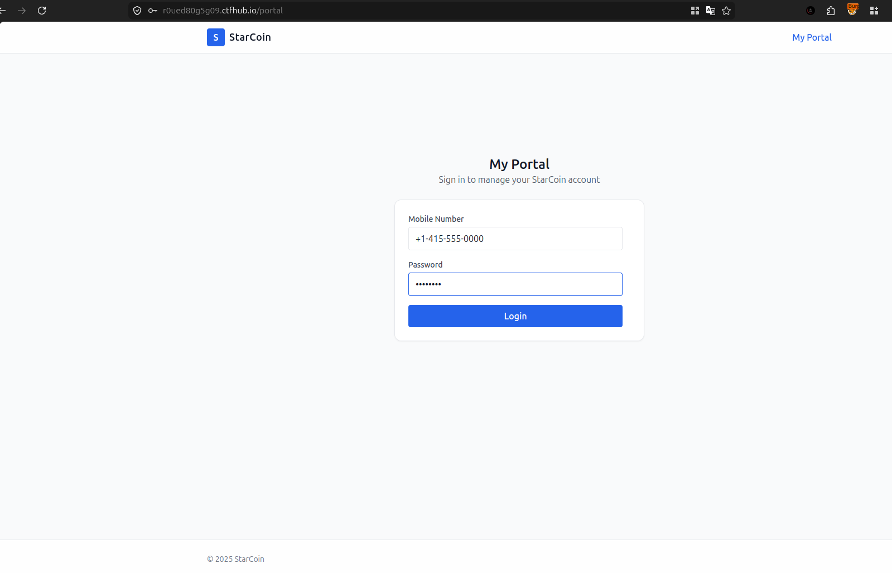

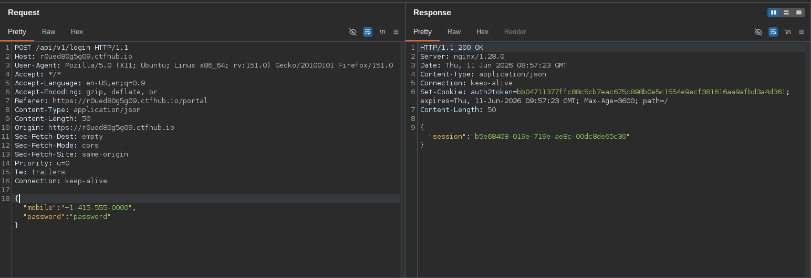

Kita bis melihat ketiak kita masuk,kita di beri Cookie `auth2token=bb04711377ffc88c5cb7eac675c898b0e5c1554e9ecf381616aa9afbd3a4d361;` .

Dan ketiak kita memasukkan 2FA Code yang benar,kita bisa melihat kalau Cookie itu di pakai disini,dan juga mengirimkan `auth3token=bb04711377ffc88c5cb7eac675c898b0e5c1554e9ecf381616aa9afbd3a4d361;`,yang di gunakna untk berhsil masuk ke akun,dan kebetukan `auth3token` ini sama persis dengan `auth2token`,dan ini sangat aneh.
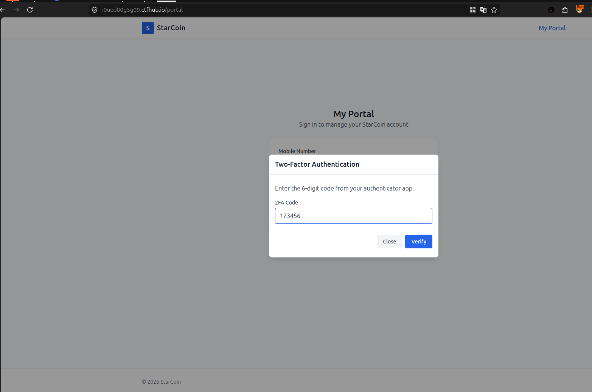

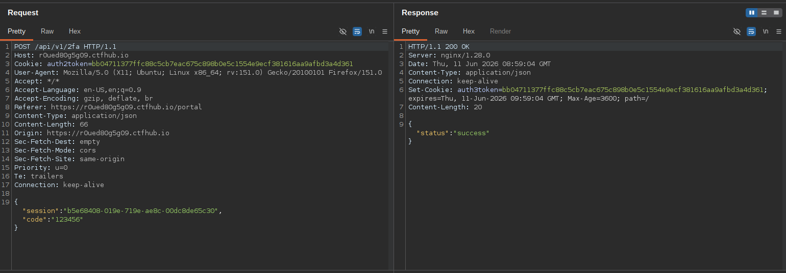

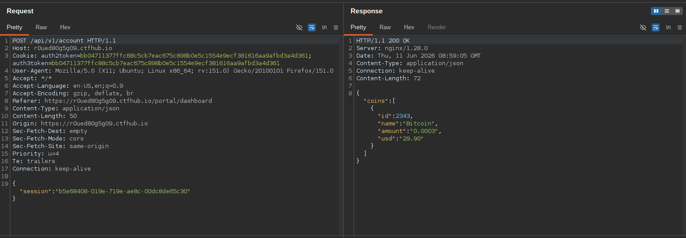


Jadi yang coba saya lakukn dalam kasus ini adalah ,kita akan mencoba login menggunakan akun victim atau akun kedua yang dimana **kita sudah mengetahui password nya**,tetapi kita tidak mengetahui koe 2FA nya.

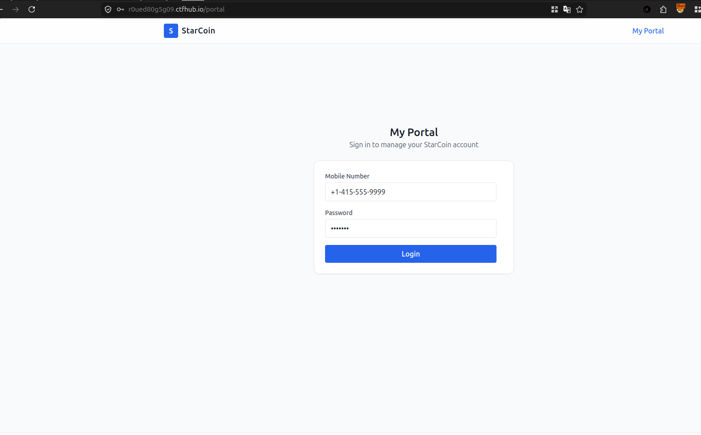

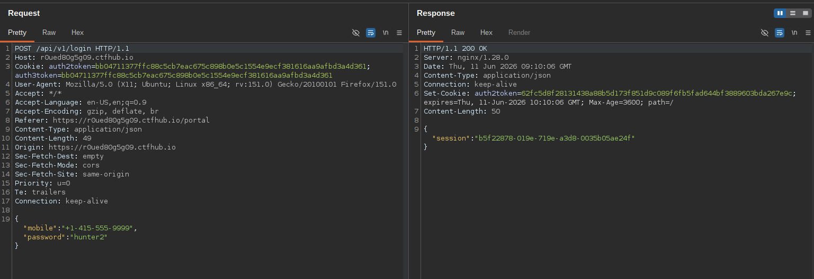

Selanjutnya kita aktifkan **Intercept**,dan masukkan 2FA random.

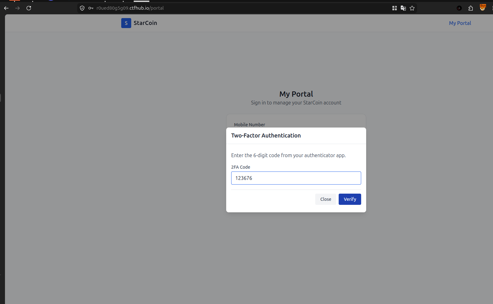

Selanjutnaya kita Modifikasi Response nya dan kita forward.

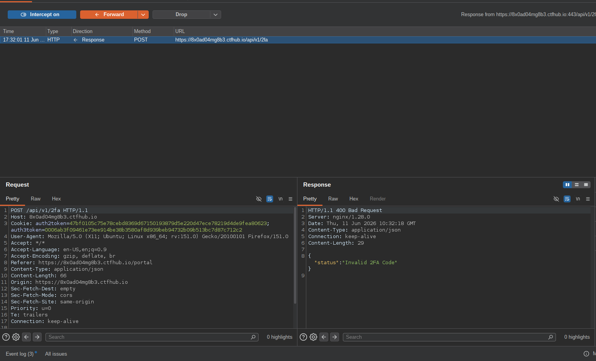

Dan BOOOMMM!!! kita sudah berhasil masuk

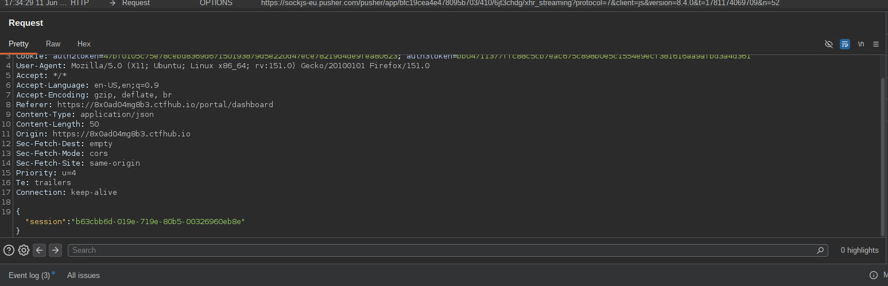

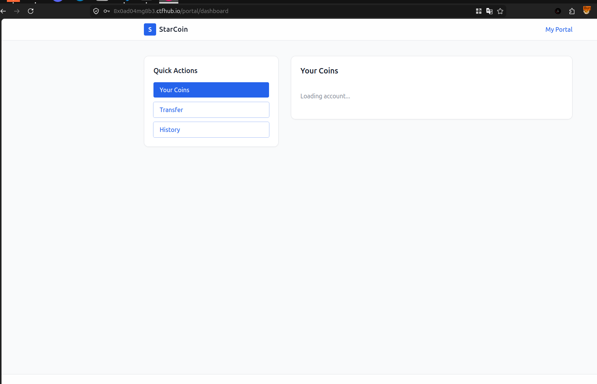